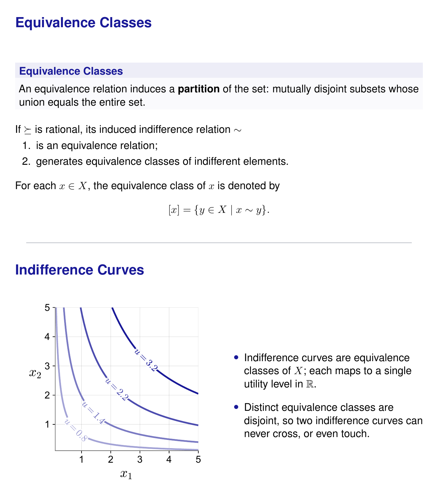
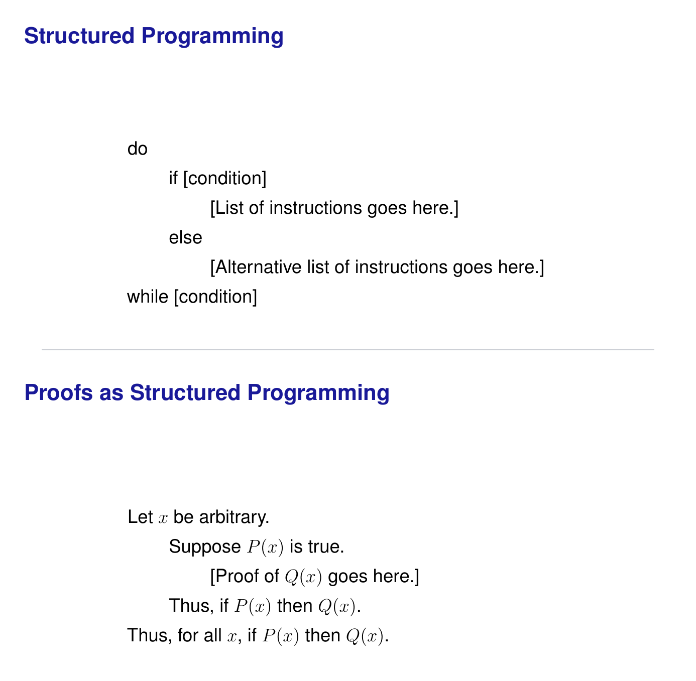
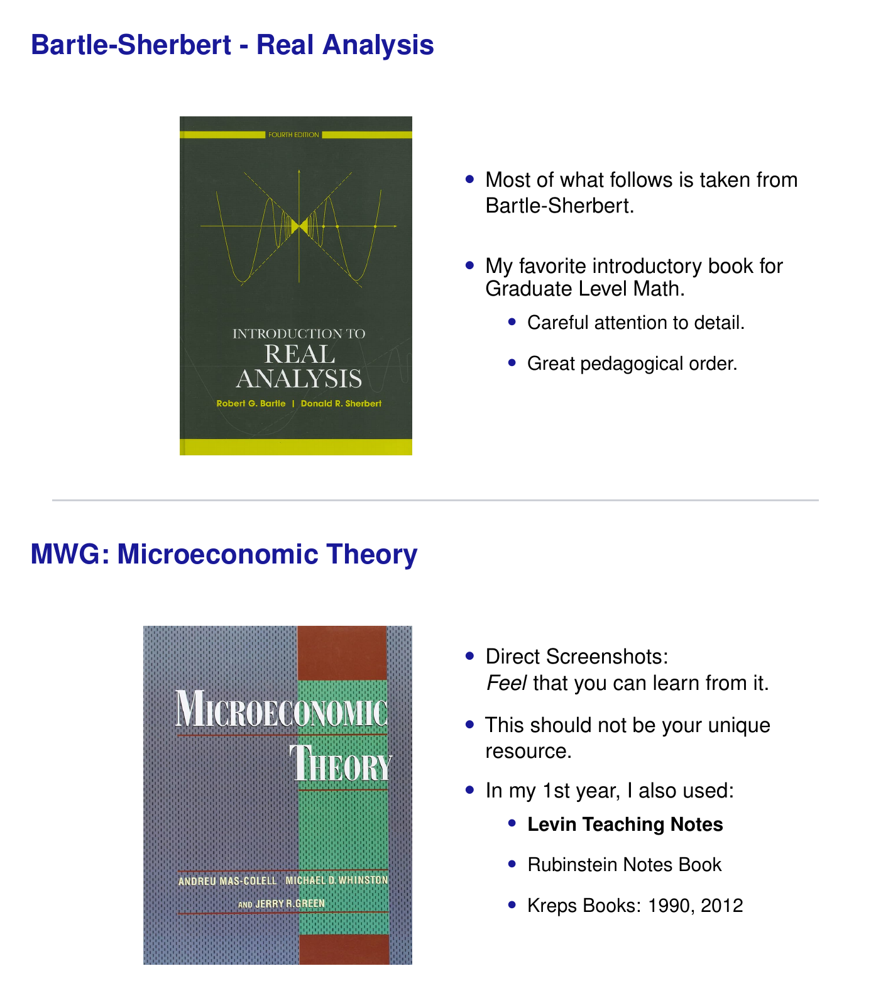
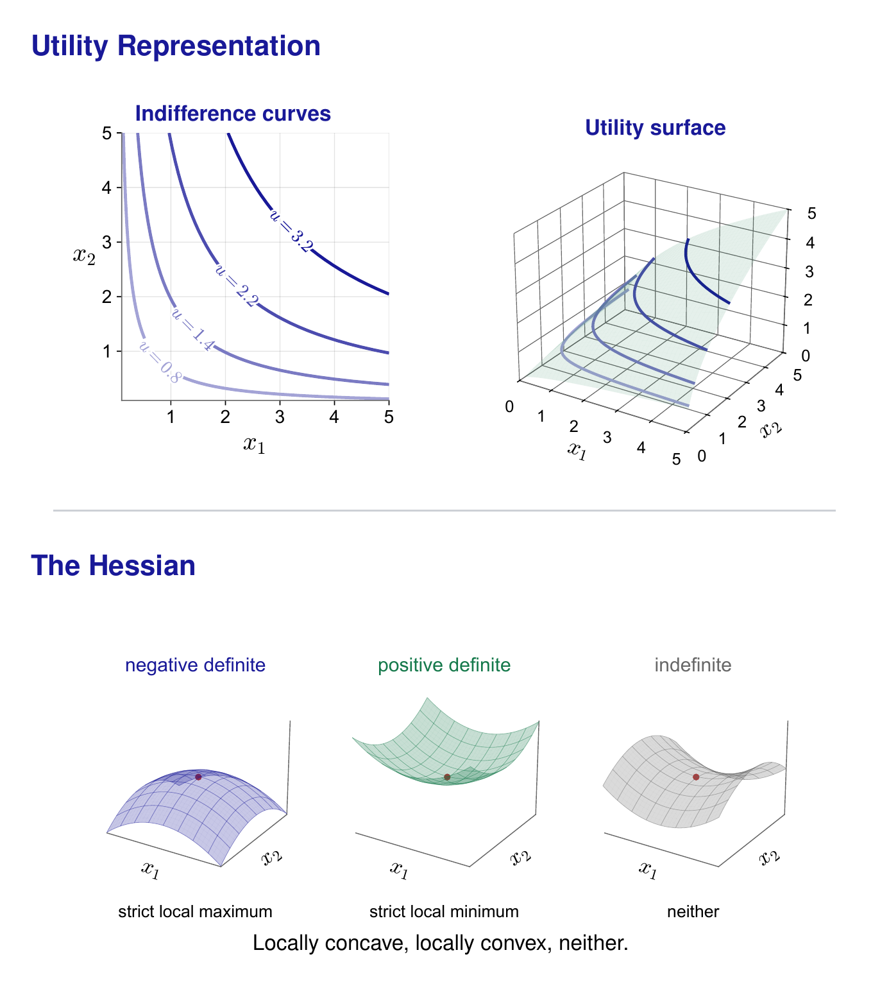

# Mathematics Bootcamp

A five-day introduction to the mathematics used in graduate microeconomics,
plus a companion handout of proofs. Slides are Beamer; figures are generated
from Python.

> **Why this exists.** The aim is narrow and practical: to carry you through
> the first fifty days of the graduate program -- far enough that the opening
> weeks of your courses read as something you can follow, rather than as a wall.
>
> Look after yourself while you do it. Your wellbeing, and your mental health,
> matter more than anything a graduate program can ever give you.

| day | topic | slides | source |
| --- | --- | --- | --- |
| 1 | Introduction to Proofs and Choice Theory | [math1.pdf](https://raw.githubusercontent.com/mvazcar/math_bootcamp/main/output/pdf/math1.pdf) (33) | [`source/math1`](source/math1) |
| 2 | Functions, Counting, The Real Numbers | [math2.pdf](https://raw.githubusercontent.com/mvazcar/math_bootcamp/main/output/pdf/math2.pdf) (27) | [`source/math2`](source/math2) |
| 3 | Properties of Preferences and Utility Functions | [math3.pdf](https://raw.githubusercontent.com/mvazcar/math_bootcamp/main/output/pdf/math3.pdf) (28) | [`source/math3`](source/math3) |
| 4 | Optimization | [math4.pdf](https://raw.githubusercontent.com/mvazcar/math_bootcamp/main/output/pdf/math4.pdf) (39) | [`source/math4`](source/math4) |
| 5 | General Equilibrium and the Social Planner | [math5.pdf](https://raw.githubusercontent.com/mvazcar/math_bootcamp/main/output/pdf/math5.pdf) (36) | [`source/math5`](source/math5) |

Slide counts in parentheses. The slide links download the PDF; the source links open the folder on GitHub.

Day 1 also has a problem set drawn from MWG Chapter 1, Sections 1.B and 1.C:
[mwg1-questions.pdf](https://raw.githubusercontent.com/mvazcar/math_bootcamp/main/output/pdf/mwg1-questions.pdf)
and
[mwg1-solutions.pdf](https://raw.githubusercontent.com/mvazcar/math_bootcamp/main/output/pdf/mwg1-solutions.pdf).
Each is a single self-contained `main.tex` -- preamble and content in one file,
no `\input` of anything else in the repository -- so either one can be handed
over or dropped into Overleaf on its own. The statements are therefore kept in
step by hand: edit one, edit the other. Every solution states what it must
produce -- the *Need to Show* -- before any of it is produced, and is then laid
out with the indentation of the structured-programming slides.

<table>
  <tr>
    <td width="50%"></td>
    <td width="50%"></td>
  </tr>
  <tr>
    <td width="50%"></td>
    <td width="50%"></td>
  </tr>
</table>

## Building

```
./build.sh            # everything
./build.sh math4      # one deck
```

Each deck is self-contained: `main.tex`, a shared `slides_header.tex`, and a
`regenerate_vector_plots.py` that draws that deck's figures. `build.sh` runs
the figure script before compiling, so the PDFs in `output/` can always be
reproduced from what is in this repository.

Requires a TeX distribution with `pdflatex` and `latexmk`, and Python with
`matplotlib` and `numpy`. The preview images additionally need poppler
(`pdftoppm`, `pdftotext`) and Pillow.

## How the slides are put together

- **One shaded box per slide, holding one formal statement.** Commentary sits
  below it as plain text. Interpretation and motivation are spoken, not
  printed.
- **Numbered statements are verbatim from the source text**, and the box title
  carries the citation -- `Sundaram 3.1`, `MWG 3.B.2`, `Kreps 2.8(b)`,
  `Bartle 1.1.5`. An unnumbered box is our own formulation, or a
  generalisation of a statement the text gives only in a special case.
- **No proofs on the slides.** They are collected in `source/proofs`, and each
  one names the slide it supports.

## Colors

One palette, used by both renderers. `source/palette.py` is the single
definition; `tools/make_palette.py` regenerates `source/palette.tex`, which
every `slides_header.tex` reads, and the figure scripts import the same values
as RGB tuples. A color cannot drift between a slide and a figure.

| name | hex | contrast on white | used for |
| --- | --- | --- | --- |
| `slideblue` | `#191998` | 12.9:1 | frame and block titles, curves |
| `slidered` | `#B93333` | 5.9:1 | what fails, improving directions |
| `slidegray` | `#686868` | 5.6:1 | axes, constraints, neutral annotation |
| `slidegreen` | `#15794B` | 5.4:1 | what holds, optima |
| `slidegold` | `#A8690F` | 4.5:1 | a fourth accent, used sparingly |

All five clear the WCAG 4.5:1 threshold for body text on white. To change one,
edit `palette.py`, then `python tools/make_palette.py && ./build.sh`.

## Sources

Statements are taken, with numbering preserved, from:

- Bartle and Sherbert, *Introduction to Real Analysis*, 4th ed. (Day 2)
- Fernández-Villaverde and Krueger, *Advanced Macroeconomics: A Dynamic
  Approach* (forthcoming) (Day 5)
- Kreps, *Microeconomic Foundations I* (Day 3)
- Mas-Colell, Whinston and Green, *Microeconomic Theory* (Days 1, 3, 4)
- Osborne, [*Mathematical Methods for Economic Theory*](https://mjo.osborne.economics.utoronto.ca/index.php/tutorial/index/1/toc)
  (Day 4, one-variable examples)
- Sundaram, *A First Course in Optimization Theory* (Day 4)

## Acknowledgements

These lectures draw on slides generously shared by:

- Andrés Erosa, *Macroeconomics I*, General Equilibrium (Day 5)
- Boris Ginzburg, *Microeconomics I*, Choice Theory (Day 3)
- Belén Jerez, *Microeconomics I*, General Equilibrium (Day 5)

Claude Fable 5 and GPT Sol 5.6 helped draft, check and revise these decks.

## Notes

`FIGURES.md` lists every figure and the slide it appears on. Regenerate it
with `python tools/make_figure_map.py`.

The preview images above are built from the compiled decks by
`python tools/make_previews.py`, which finds each slide by its title rather
than by page number. It needs `pdftoppm` and `pdftotext` (poppler) and Pillow.

Reference material used in preparing these notes is not redistributed here;
`reference/` is git-ignored.
